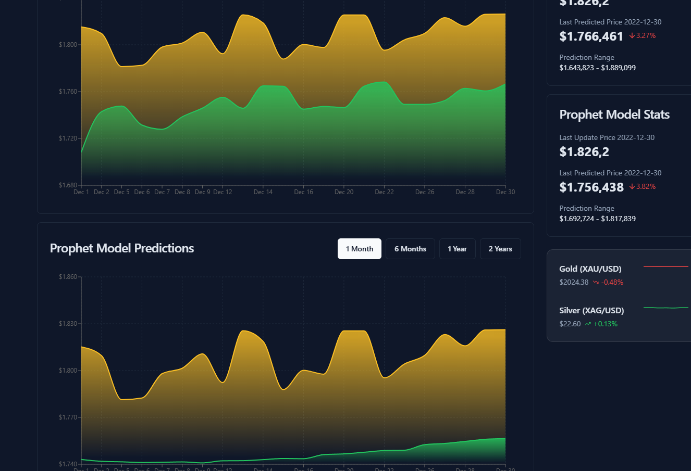
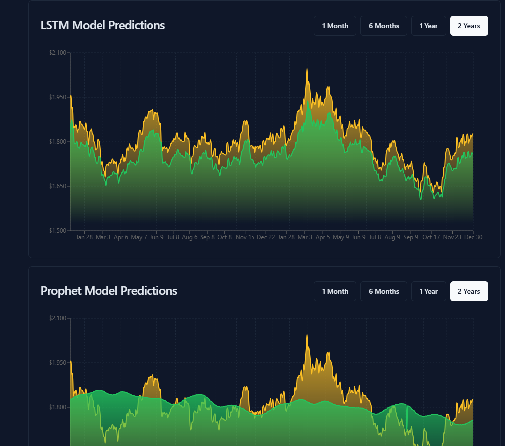
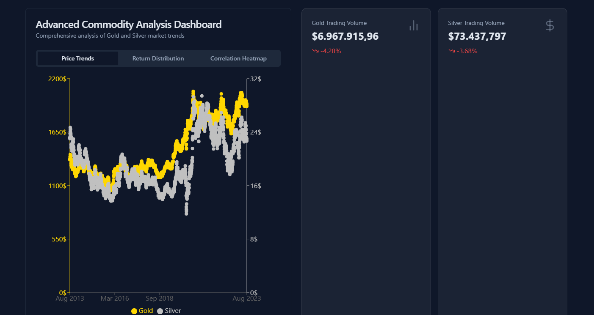
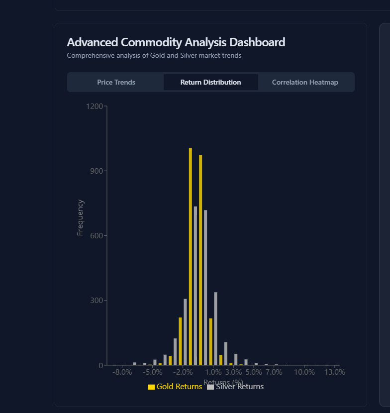
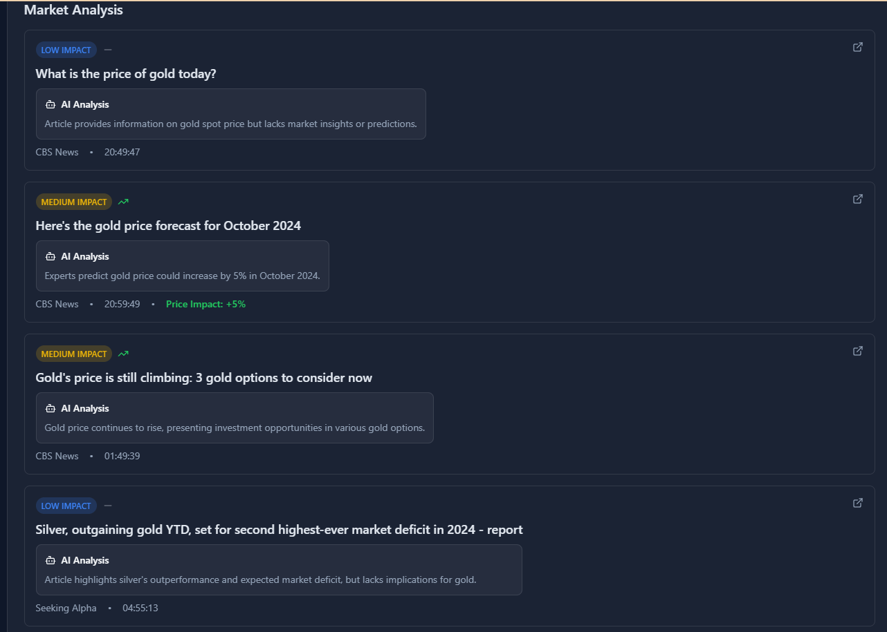
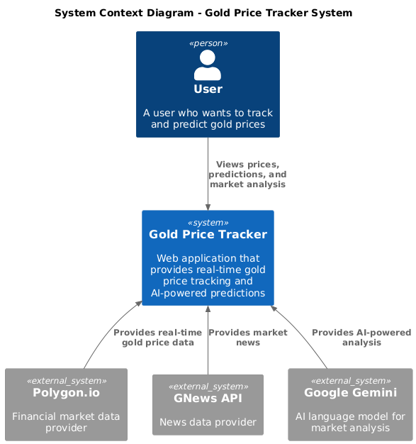
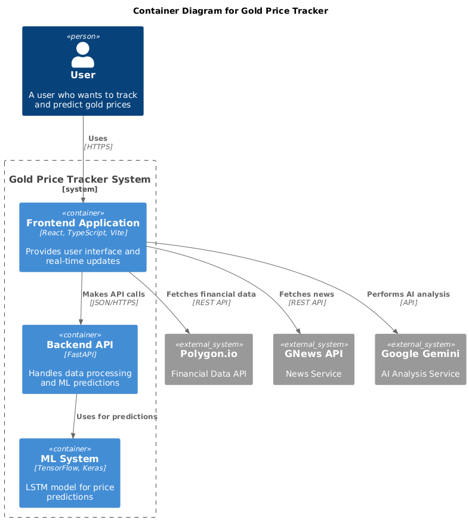
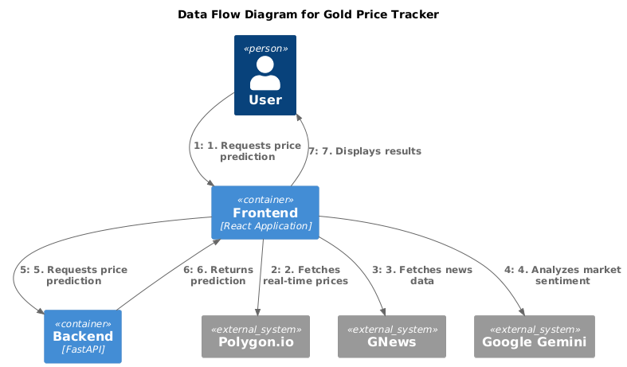
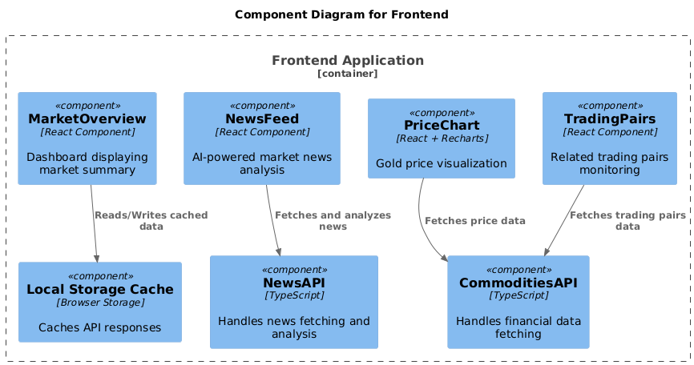
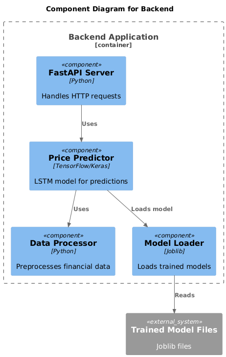

# Gold Price Tracker

Gold Price Tracker is a web application that predicts the future price of gold based on historical data. The application uses a Long Short-Term Memory (LSTM) neural network to model the complex relationships in gold prices. Users can input a date range and receive a forecasted price for the end of the period. The model is trained on gold prices from 2017 to 2021 and provides a reliable estimate of future trends.


## Demo








## Business Requirements

### Data Accuracy
- Real-time gold price updates with < 1-minute delay
- Historical data accuracy verified against multiple sources
- News sourced from reputable financial outlets
- AI analysis confidence scoring system

### Performance
- Initial page load < 3 seconds
- Real-time updates < 500ms
- Caching strategy:
  - Price data: 1 minute
  - News analysis: 30 minutes
  - Historical data: 24 hours

## Features

### Real-time Market Data
- Live gold price tracking
- Historical price charts with customizable timeframes
- Price statistics and trend analysis
- Related trading pairs monitoring

### AI-Powered Market Analysis
- Real-time news aggregation from reliable sources
- AI-driven sentiment analysis of market news
- Impact assessment on gold prices
- Price movement predictions based on news events

### User Experience
- Responsive design for all devices
- Dark/light theme support
- Customizable dashboard layout
- Real-time data updates
- Efficient caching system to prevent rate limiting

## Diagram

### C1: System Context Diagram



### C2: Container Diagram



### Data flow




## Project Structure

### Frontend



```
frontend/
├── src/
│   ├── components/
│   │   ├── NewsFeed.tsx        # AI-powered market news analysis
│   │   ├── NewsItem.tsx        # Individual news item display
│   │   ├── PriceChart.tsx      # Gold price visualization
│   │   ├── PriceStats.tsx      # Price statistics and metrics
│   │   ├── MarketOverview.tsx  # Market summary dashboard
│   │   ├── TradingPairs.tsx    # Related trading pairs
│   │   └── ui/                 # Reusable UI components
│   ├── lib/
│   │   ├── newsApi.ts          # News fetching and analysis
│   │   ├── commoditiesApi.ts   # Gold price data fetching
│   │   └── cache.ts            # Caching utilities
│   └── pages/
│       ├── Index.tsx           # Main dashboard page
│       └── Settings.tsx        # User preferences
```


### Backend



```
backend/
│
├── main.py                 # FastAPI
├── requirements.txt         # Python dependencies
├── data.csv                 # Gold Price 2017 - 2021
├── gold_price_model.joblib      # Trained model
├── gold_price_scaler.joblib     # Data scaler
```

## Tech Stack

### Frontend

- React with TypeScript
- Vite for build tooling
- Tailwind CSS for styling
- shadcn/ui for components
- Recharts for data visualization
- Google Gemini for AI analysis
- Tanstack Query for data fetching

### Backend


### Machine Learning Stack

- Core Libraries
    - Deep Learning:
        - TensorFlow (Neural Network)
        - Keras (High-level Neural Network API)
- Scientific Computing:
    - NumPy (Numerical computations)
    - Pandas (Data manipulation)
- Machine Learning:
    - Scikit-learn
        - MinMaxScaler (Data normalization)
        - train_test_split (Data splitting)
        - mean_absolute_percentage_error (Evaluation metric)
- Model Serialization:
    - Joblib (Model and scaler saving/loading)

## Model Details

### Algorithm Choice

LSTM (Long Short-Term Memory) 

- Memory Mechanism
    - Can capture long-term dependencies
    - Remembers important information over extended periods
    - Critical for financial time series where past events significantly impact future prices

- Non-linear Pattern Recognition
    - Captures complex, non-linear relationships
    - Understands intricate market dynamics
    - Can learn from:
        - Historical price movements
        - Seasonal patterns
        - Subtle market signals
```
input1 = tf.keras.layers.Input(shape=(self.window_size, 1))
x = tf.keras.layers.LSTM(64, return_sequences=True)(input1)
x = tf.keras.layers.Dropout(0.2)(x)
x = tf.keras.layers.LSTM(64, return_sequences=True)(x)
x = tf.keras.layers.Dropout(0.2)(x)
x = tf.keras.layers.LSTM(64)(x)
x = tf.keras.layers.Dropout(0.2)(x)
x = tf.keras.layers.Dense(32, activation='relu')(x)
output = tf.keras.layers.Dense(1)(x)
```

Architecture Breakdown

- Multiple LSTM Layers (64 units)
    - First layer: Processes sequential data
    - Subsequent layers: Extract higher-level representations
    - Each layer adds complexity and depth to learning

- Dropout Layers (0.2)
    - Prevents overfitting
    - Forces network to learn robust, generalized features
    - Reduces model's dependency on specific training instances


- Dense Layers
    - Final layers for regression output
    - Transforms learned representations into price prediction


#### Core Features


#### Engineered Features


### Data Preprocessing Considerations

- Window Size Selection (356 * 2 = 712 days)

    - Approximately 2 years of historical data
    - Captures:
        - Annual market cycles
        - Seasonal price variations
        - Medium-term economic trends

- Loads CSV data
- Cleans and transforms price data
- Uses MinMaxScaler for data normalization
- Creates sliding window approach for time series prediction

#### Data Transformation Techniques

1. Price Normalization

```
scaler = MinMaxScaler()
scaled_prices = scaler.fit_transform(df.Price.values.reshape(-1, 1))
```

- Scales prices to [0, 1] range
- Ensures all features contribute equally
- Prevents dominance of larger numerical values

2. Sliding Window Approach

```
X, y = [], []
for i in range(self.window_size, len(scaled_prices)):
    X.append(scaled_prices[i-self.window_size:i, 0])
    y.append(scaled_prices[i, 0])
```

- Creates sequences of historical prices
- Each prediction uses previous 712 days' data
- Allows model to learn temporal patterns

### Model Pros and Cons

#### Pros

- Captures complex temporal patterns
- Handles non-linear relationships
- Provides uncertainty estimates
- Robust to market volatility
- Reproducible via fixed random seed

#### Cons

- Computationally expensive
- Requires substantial historical data
- Sensitive to window size selection
- May struggle with sudden market disruptions
- Potential overfitting risk

### Limitations and Considerations

- Not predictive of extreme black swan events
- Assumes past patterns will somewhat repeat
- Should be used as one of multiple decision-making tools
- Regular retraining recommended

### Model Pipeline


### Data Sources

- `data.csv`: Gold Price 2017 - 2021


## Installation


1. Install dependencies:
```bash
//Go to the frontend directory
cd frontend
npm install

//Go to the backend directory
cd backend
python install -r requirements.txt
```

2. Start the development server:
```bash

//Go to the frontend directory
cd frontend
npm run dev 

//Now it available on localhost:5173

//Go to the backend directory

cd backend
python main.py
```

